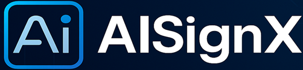
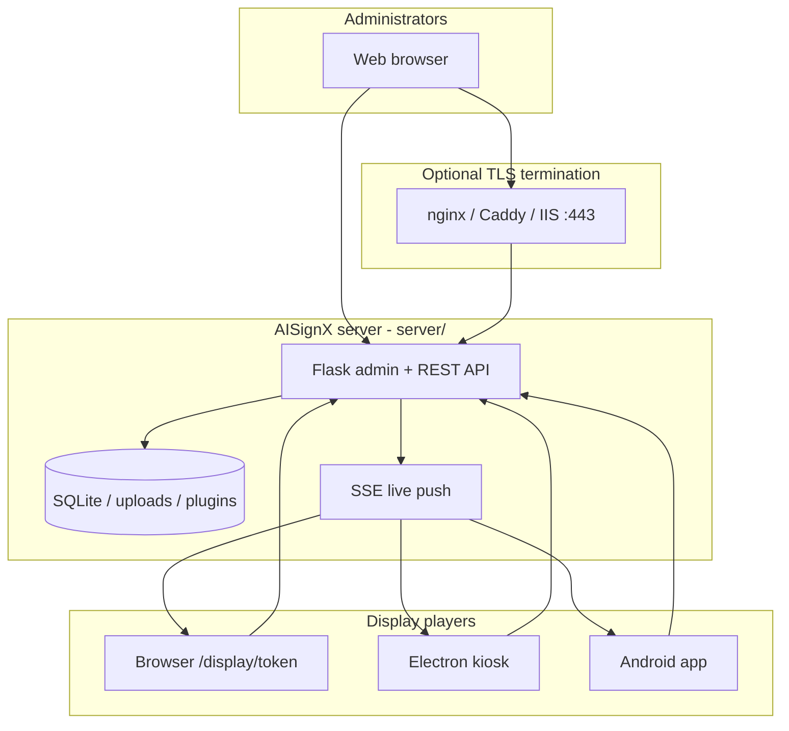

<p align="center">
  
</p>

<h1 align="center">AISignX</h1>

<p align="center">
  <strong>Self-hosted digital signage</strong> — manage screens from one web admin.<br>
  Playlists, schedules, live updates, multi-tenant, browser &amp; kiosk clients.
</p>

<p align="center">
  <a href="LICENSE"></a>
  
  
  <a href="CHANGELOG.md"></a>
</p>

<p align="center">
  <a href="#one-minute-quick-start">Quick start</a> ·
  <a href="#features">Features</a> ·
  <a href="docs/README.md">Documentation</a> ·
  <a href="CHANGELOG.md">Changelog</a> ·
  <a href="CONTRIBUTING.md">Contributing</a>
</p>

---

## Table of contents

- [What this is](#what-this-is)
- [Who it is for](#who-it-is-for)
- [Features](#features)
- [Screenshots](#screenshots)
- [One-minute quick start](#one-minute-quick-start)
- [After install — first display](#after-install--first-display)
- [Architecture](#architecture)
- [Documentation](#documentation)
- [Build display clients](#build-display-clients-optional)
- [Production & Docker](#production--docker)
- [Repository layout](#repository-layout)
- [Project status](#project-status)
- [License](#license)

---

## What this is

**AISignX** is an open-source **digital signage platform** you run on your own server.

| You get | Details |
|---------|---------|
| **Web admin** | Upload media, build playlists, assign schedules, manage tenants |
| **Players** | Any Chromium browser, **Windows/Linux kiosk** (Electron), **Android** app |
| **Live control** | Push playlist and emergency changes over SSE — no manual refresh on screens |
| **Operations** | Audit log, backups, proof of play, health checks, REST API |

You own the data (SQLite by default, portable to Postgres later). No cloud subscription required.

> **Install from source:** Pre-built [GitHub Releases](https://github.com/linuxr123/aisignx/releases) are **not published yet**. Clone this repo, run the server, and build clients when you need them.

---

## Who it is for

| Use case | Fit |
|----------|-----|
| Retail, lobby, or menu boards | Playlists + time-based schedules |
| Internal communications | Web pages, RSS/weather plugins, emergency override |
| MSP / integrator | Multiple **tenants** with roles and branding |
| Dedicated hardware | Full-screen Electron or Android kiosk |
| Quick evaluation | Browser player at `/display/<token>` — no app install |

---

## Features

<details open>
<summary><strong>Core platform</strong></summary>

- Multi-tenant admin (**Tenants** in UI; isolated data per customer)
- Roles & permissions, API tokens, audit log (CSV/JSON export)
- Idempotent schema evolution at boot; background jobs (heartbeat, backups, retention)

</details>

<details open>
<summary><strong>Content & playback</strong></summary>

- Media library: images, video, **HTTP/HTTPS webpage URLs**, tags, folders, bulk actions
- Playlists: transitions (incl. random pool), smart rules, plugins, video clip range, audio rules
- Schedules on displays or groups; conflict visualiser; **emergency broadcast**
- Synchronized playback across a display group; proof of play (optional)

</details>

<details open>
<summary><strong>Displays & clients</strong></summary>

- Pairing / enrollment, remote commands (reload, reboot, update client, screenshot)
- **Browser**, **Electron** (Windows/Linux), **Android** players
- Offline-friendly caching; SSE live updates

</details>

<details open>
<summary><strong>Operations & security</strong></summary>

- Scheduled backups, restore with pre-snapshot, rate limiting
- HTTP or HTTPS deploy modes (`generate_config.py --interactive`)
- Docker Compose reference; nginx/Caddy/IIS reverse-proxy guides

</details>

Full catalog with roadmap markers: **[FEATURES.md](server/docs/FEATURES.md)**

---

## Screenshots

| | |
|:---:|:---:|
| **Brand** | **Admin UI** *(add your own screenshots to `docs/images/`)* |
|  | Run locally → open `http://localhost:5000` after [quick start](#one-minute-quick-start) |

We welcome PRs that add redacted screenshots (`docs/images/dashboard.png`, `playlist-editor.png`, etc.). See [docs/images/README.md](docs/images/README.md).

---

## One-minute quick start

**Goal:** Admin UI on your machine in a few commands.

```bash
git clone https://github.com/linuxr123/aisignx.git
cd aisignx
```

<table>
<tr><th>Windows</th><th>Linux / macOS</th></tr>
<tr><td>

```powershell
powershell -ExecutionPolicy Bypass -File server\install_windows.ps1
cd server
.\.venv\Scripts\Activate.ps1
python app.py
```

</td><td>

```bash
chmod +x server/install_linux.sh && ./server/install_linux.sh
cd server
source .venv/bin/activate
python app.py
```

</td></tr>
</table>

Open **http://localhost:5000** → `admin` / `Admin123!` → **change the password immediately**.

| Next | Link |
|------|------|
| Detailed install | [GETTING_STARTED.md](server/docs/GETTING_STARTED.md) |
| HTTP vs HTTPS | `cd server` → `python generate_config.py --interactive` |
| All docs | [docs/README.md](docs/README.md) |

---

## After install — first display

First boot creates a **Default** tenant and admin user. No separate demo database is required.

1. **Change the admin password** (Profile).
2. **Upload media** — Media → add images, videos, or a webpage URL.
3. **Create a playlist** — add items, set durations.
4. **Register a display** — Displays → add or open `/display/<token>` in a browser.
5. **Assign playlist** — Display detail → select playlist.

Step-by-step: **[docs/FIRST_STEPS.md](docs/FIRST_STEPS.md)**

---

## Architecture



| Path | Purpose |
|------|---------|
| `server/` | Flask application (admin UI, API, plugins) |
| `clients/` | Electron + Android source |
| `docs/` | Documentation index, architecture notes, image placeholders |
| `build_clients_*` | Package clients → `server/static/clients/` |

Deeper dive: **[docs/ARCHITECTURE.md](docs/ARCHITECTURE.md)** · [HTTP/HTTPS modes](server/docs/SERVER_HTTP_ONLY_or_HTTPS_ONLY_Version2.md)

---

## Documentation

| I want to… | Start here |
|------------|------------|
| Install & configure | [GETTING_STARTED.md](server/docs/GETTING_STARTED.md) |
| Run signage day-to-day | [USER_GUIDE.md](server/docs/USER_GUIDE.md) |
| Manage users & tenants | [ADMIN_GUIDE.md](server/docs/ADMIN_GUIDE.md) |
| Integrate via API | [API.md](server/docs/API.md) |
| See every guide | **[docs/README.md](docs/README.md)** |

---

## Build display clients (optional)

Native installers are **built from source** (not on GitHub Releases yet).

```powershell
# Windows — repo root
powershell -ExecutionPolicy Bypass -File build_clients_windows.ps1 -Help
```

```bash
# Linux — repo root
./build_clients_linux.sh --help
```

Output: `server/static/clients/` · Guides: [clients/README.md](clients/README.md), [CLIENTS.md](server/docs/CLIENTS.md)

---

## Production & Docker

```bash
cp .env.example server/.env
# Set AISIGNX_SECRET_KEY; use AISIGNX_DEPLOY_MODE=https behind a proxy

cd server
python generate_config.py --mode https --hostname signage.example.com
docker compose up -d --build   # optional
```

[PRODUCTION_DEPLOYMENT.md](server/docs/PRODUCTION_DEPLOYMENT.md) · [DEPLOY_LINUX.md](server/docs/DEPLOY_LINUX.md) · [DEPLOY_WINDOWS.md](server/docs/DEPLOY_WINDOWS.md)

---

## Repository layout

```text
aisignx/
├── README.md              ← you are here
├── CHANGELOG.md           ← version history
├── docs/                  ← documentation index + architecture
├── server/                ← Flask app + server/docs/ guides
├── clients/               ← Electron + Android
└── build_clients_*.ps1|.sh
```

---

## Project status

| Item | Status |
|------|--------|
| **License** | [AGPL-3.0-or-later](LICENSE) |
| **Changelog** | [CHANGELOG.md](CHANGELOG.md) — active on `main` |
| **GitHub Releases** | Not yet — install from `main`; tags/releases when ready |
| **Contributing** | [CONTRIBUTING.md](CONTRIBUTING.md) · [SECURITY.md](SECURITY.md) |

Development happens on **`main`**. Check the [commit history](https://github.com/linuxr123/aisignx/commits/main) and changelog for recent changes.

---

## License

AISignX is free software under the [GNU Affero General Public License v3.0 or later](LICENSE).

Modified versions distributed or offered as a network service must provide corresponding source under AGPL. See [THIRD_PARTY_LICENSES.md](THIRD_PARTY_LICENSES.md) for dependency licenses.
