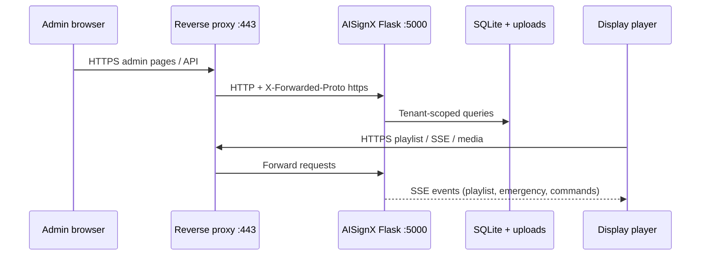

# AISignX architecture

High-level view of how the repository fits together. For install steps see [README.md](../README.md) and [GETTING_STARTED.md](../server/docs/GETTING_STARTED.md).

---

## Components

| Component | Location | Technology |
|-----------|----------|------------|
| **Server** | `server/` | Python 3, Flask, SQLAlchemy, SQLite (default) |
| **Admin UI** | `server/templates/`, `server/static/` | Bootstrap, server-rendered HTML + JS |
| **REST API** | Flask blueprints under `server/` | JSON; token and session auth |
| **Plugins** | `server/plugins/<name>/` | JS runners in sandboxed iframes |
| **Electron client** | `clients/electron-client/` | Electron, Node.js |
| **Android client** | `clients/android-client/` | Kotlin, WebView |
| **Client packaging** | `build_clients_windows.ps1`, `build_clients_linux.sh` | Copies artifacts to `server/static/clients/` |

---

## Request flow (typical production)

- TLS terminates at **nginx, Caddy, or IIS** (recommended for production).
- AISignX listens on **127.0.0.1:5000** (or behind Docker port mapping).
- `TRUST_PROXY` and `AISIGNX_DEPLOY_MODE=https` align generated URLs and cookies.

---

## Multi-tenancy

- Each customer workspace is a **Tenant** in the UI (`Domain` in the database).
- `tenant_filter.py` applies `domain_id` to ORM queries automatically.
- Superadmins can switch tenant context; regular users are scoped server-side.
- Details: [MULTI_TENANCY.md](../server/docs/MULTI_TENANCY.md)

---

## Live updates (SSE)

Displays keep a long-lived **Server-Sent Events** connection. The server pushes:

- Playlist / schedule changes  
- Emergency broadcast state  
- Remote commands (reload, reboot, update, etc.)  
- Plugin policy changes  

nginx/Caddy configs must disable buffering on the proxy path. See [PRODUCTION_DEPLOYMENT.md](../server/docs/PRODUCTION_DEPLOYMENT.md).

---

## Configuration layers

| Layer | File / tool | Purpose |
|-------|-------------|---------|
| Deploy mode | `AISIGNX_DEPLOY_MODE` in `config.py` | `http` vs `https` presets |
| Wizard | `python generate_config.py --interactive` | Generate `config.py` |
| Environment | `server/.env`, Docker Compose | Secrets and paths |
| Runtime settings | Admin → Settings | Feature toggles, quotas, retention |

---

## Data storage

| Data | Default location |
|------|------------------|
| Database | `server/digital_signage.db` (or `AISIGNX_DB_PATH`) |
| Media uploads | `server/uploads/` |
| Logs | `server/logs/` |
| Backups | Configurable; default under server backups path |
| Built clients | `server/static/clients/` (gitignored binaries) |

---

## Security boundaries

- **Never commit:** `config.py`, `.env`, keystores, databases, uploads.
- **AGPL-3.0:** See [LICENSE](../LICENSE) for distribution and network-use obligations.
- **Signed media URLs** and **plugin sandbox/CSP** per tenant policy.

---

## Related docs

- [FIRST_STEPS.md](FIRST_STEPS.md) — first playlist on a display  
- [README.md](README.md) — documentation index  
- [FEATURES.md](../server/docs/FEATURES.md) — capability catalog  
